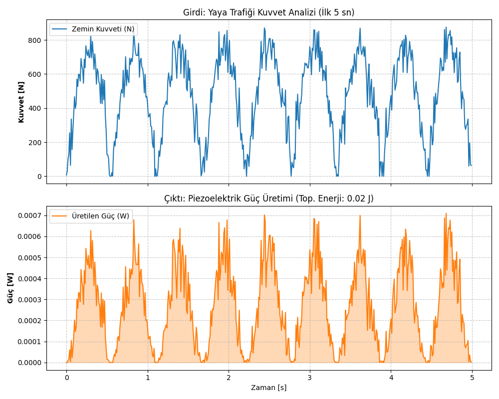

# PiezoEnergy-Sim

# PiezoEnergy-Sim

> This Python tool simulates energy harvesting from high-traffic mall flooring using piezoelectric transducers. It calculates potential power output based on footfall frequency and dynamic force inputs.

## Proje Hakkında
Bu proje, yüksek yaya trafiğine sahip alanlardaki zeminlerden piezoelektrik dönüştürücüler aracılığıyla enerji geri kazanımı potansiyelini simüle etmek amacıyla geliştirilmiştir.

## Gereksinimler
Bu simülasyonu çalıştırmak için aşağıdaki kütüphanelere ihtiyaç vardır:
* numpy
* matplotlib

## Kullanım
`simulation.py`dosyasını çalıştırarak sonuçları görebilirsiniz.

## Simülasyon Sonuçları
Aşağıdaki grafik, simülasyonun ürettiği stokastik yaya kuvvetlerini ve elde edilen güç çıktısını gösterir:

## Mühendislik Teorisi (Engineering Background)

Bu simülasyon, mekanik stresin elektrik yüküne dönüşümünü sağlayan **Doğrudan Piezoelektrik Etki** prensibine dayanır.

Kullanılan basitleştirilmiş güç modeli:

$$P(t) = \frac{V(t)^2}{R_{load}}$$

Burada üretilen anlık voltaj $V(t)$, uygulanan dinamik kuvvet $F(t)$ ve piezoelektrik yük katsayısı $d_{33}$ ile ilişkilidir:

$$V(t) = \frac{d_{33} \cdot F(t)}{C_{piezo}}$$

*Modelde PZT-5H seramiği için tipik katsayılar kullanılmıştır.*
